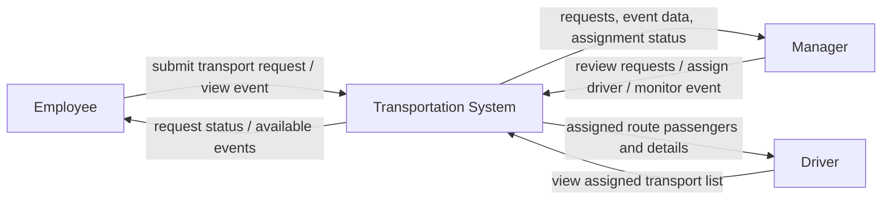
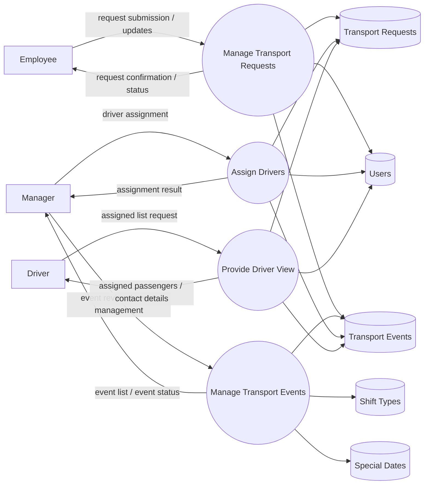
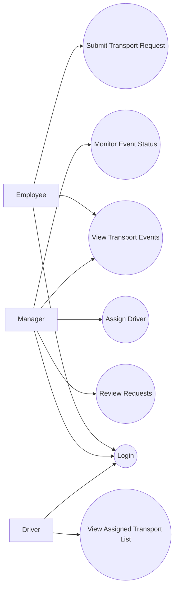
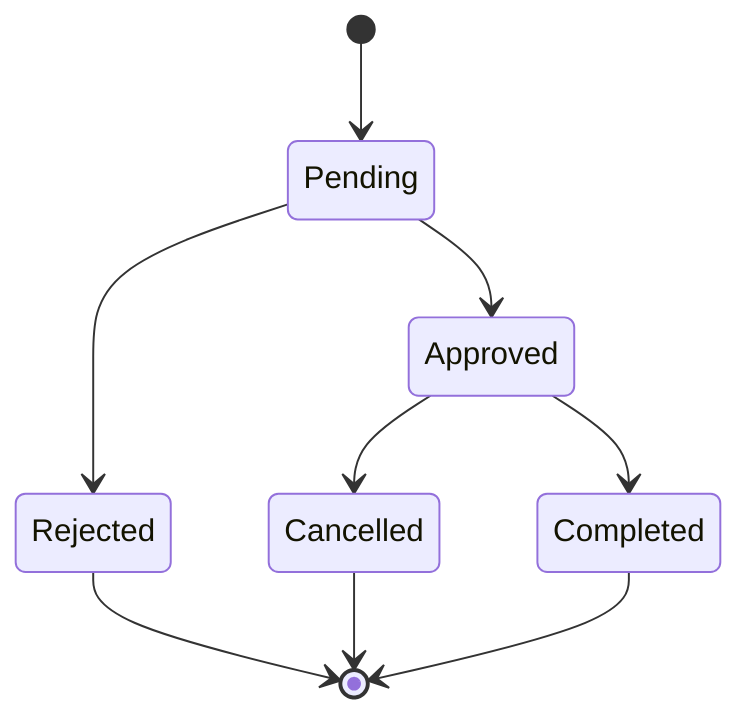

# Transportation System Project

<p align="center">
  
  
  
  
  
</p>

## Overview

A backend-oriented internal web application for managing employee transportation in shift-based operations.

The project replaces manual coordination through chat groups and ad hoc communication with a structured system for:

- employees submitting transport requests
- managers reviewing and assigning transportation
- drivers receiving assigned transport lists
- maintaining a central operational source of truth

---

## Main Goals

- Centralize transport request submission
- Reduce manual coordination overhead
- Improve visibility into transport demand per shift and date
- Support managers in assigning drivers
- Create a maintainable portfolio-grade backend system

---

## Core Roles

- **Employee**
  - logs in
  - views relevant transport events
  - submits pickup / drop-off / both

- **Manager**
  - creates or monitors transport events
  - reviews requests
  - assigns drivers
  - monitors status

- **Driver**
  - views assigned transport events
  - sees passenger list
  - sees phone and address details when relevant

---

## Business Context Diagram



---

## DFD-0



---

## Use Case Diagram



---

## Request Lifecycle



---

## High-Level Architecture

<!-- AUTO-GENERATED:COMPONENT-DIAGRAM:START -->
_Auto-generated by scripts/generate_readme_assets.py_
<!-- AUTO-GENERATED:COMPONENT-DIAGRAM:END -->

---

## Data Model (ERD)

<!-- AUTO-GENERATED:ERD:START -->
_Auto-generated by scripts/generate_readme_assets.py_
<!-- AUTO-GENERATED:ERD:END -->

---

## Project Structure

<!-- AUTO-GENERATED:PROJECT-TREE:START -->
_Auto-generated by scripts/generate_readme_assets.py_
<!-- AUTO-GENERATED:PROJECT-TREE:END -->

---

## Tech Stack

| Layer | Technology |
|---|---|
| Language | Java 17 |
| Framework | Spring Boot |
| Persistence | Spring Data JPA / Hibernate |
| Database | PostgreSQL |
| Templating | Thymeleaf |
| Validation | Bean Validation |
| Build Tool | Maven |
| IDE | IntelliJ IDEA |

---

## Current Domain Scope

Current main entities:

- `users`
- `shift_types`
- `transport_events`
- `transport_requests`
- `special_dates`

Current backend layers already present in the project:

- `controller`
- `dto`
- `entity`
- `enums`
- `exception`
- `repository`
- `service`

---

## Run Locally

### Option A — use repository SQL initialization as currently configured

The current repository configuration is suitable for startup-based SQL initialization.

1. Create the database:

```sql
CREATE DATABASE shift_transport;
```

2. Update `src/main/resources/application.yml` with your local PostgreSQL credentials if needed.

3. Run:

```bash
mvn spring-boot:run
```

4. Open:

```text
http://localhost:8080/auth/login
```

---

### Option B — run `schema.sql` and `data.sql` manually first

If you execute SQL manually in DataGrip or PostgreSQL first, update:

```yaml
spring:
  jpa:
    hibernate:
      ddl-auto: validate

  sql:
    init:
      mode: never
```

Then run the application normally.

---

## Roadmap

### Near Term
- improve employee request flow
- complete manager assignment flow
- complete driver assigned-list flow
- strengthen validation rules
- improve auth flow

### Later
- OTP integration
- route optimization
- maps / navigation integration
- better operational reporting
- automated special-date handling

---

## Documentation Strategy

This repository uses two diagram categories:

### 1. Business diagrams
These describe the system from an analysis/design perspective and are intentionally written as Mermaid in the README:
- Context Diagram
- DFD-0
- Use Case Diagram
- Request Lifecycle

### 2. Generated structural diagrams
These are refreshed automatically from the actual repository:
- Project Structure
- Component Diagram
- ERD from `schema.sql`

This keeps the README aligned with real code and database changes.

---

## Automatic README Refresh

This repository includes:
- a Python generator script
- a GitHub Action

After every push to `main`, generated sections in the README can be refreshed automatically.
